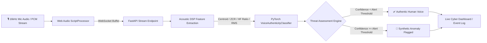

<div align="center">

# 🛡️ Voice Guardian (SIH26104)
### Real-Time AI Voice Cloning & Impersonation Defense System

[](https://fastapi.tiangolo.com)
[](https://pytorch.org)
[](https://websockets.readthedocs.io/)
[](https://www.python.org/)
[](LICENSE)

<p align="center">
  <b>A sub-10ms latency defense engine protecting critical communications and financial transactions against generative AI voice clones and synthetic speech spoofing.</b>
</p>

---

</div>

## 📌 Overview

**Voice Guardian** is an enterprise-grade cybersecurity pipeline engineered to detect and neutralize synthetic voice cloning attacks in real time. Combining **Digital Signal Processing (DSP)** with a **PyTorch Deep Neural Network**, Voice Guardian analyzes high-frequency phase artifacts, vocoder discontinuities, spectral centroids, and zero-crossing dynamics to output an instantaneous impersonation threat verdict.



---

## ✨ Key Features

- **⚡ Ultra-Low Latency Streaming**: Sub-10ms real-time audio chunk processing using bi-directional WebSockets and raw 16kHz PCM streaming.
- **🔬 Hybrid DSP + Deep Learning Detection**:
  - **Vocoder Phase Discontinuity Detection**: Identifies synthetic high-frequency energy anomalies (`>3000Hz` HF ratio).
  - **Spectral Centroid & Formant Calibration**: Evaluates human vocal tract resonant frequencies (`800Hz - 2600Hz`).
  - **Zero Crossing Rate (ZCR) & RMS Energy VAD**: Filters environmental silence and detects robotic pitch modulation.
  - **PyTorch Neural Network**: Multi-layer classifier (`BatchNorm1d`, `Dropout`, `ReLU`, `Sigmoid`) trained on MFCC and acoustic distributions.
- **🎯 Context-Sensitive Risk Modes**:
  - **High Value / High Risk**: Stricter 55–60% alert limit for financial and executive authorization calls.
  - **Standard Call**: 75–80% threshold for everyday conversational verification.
- **🇮🇳 Regional Indian Accent Calibration**: Tailored acoustic baselines for **Tamil**, **Hindi**, **Telugu**, and **General Indian** dialects.
- **📊 Dataset Volunteer Mode**: In-app option to record and curate live labeled `.wav` speech samples with accent metadata for continuous offline retraining.
- **🖥️ Cyberpunk Glassmorphic HUD**: Interactive HTML5 visualizer with real-time waveform canvas, latency tracking, risk gauges, and security event timelines.

---

## 📁 Repository Structure

```tree
voice-guardian/
├── backend/
│   ├── app/
│   │   ├── main.py                   # Alternative FastAPI app modular routing
│   │   └── model.py                  # PyTorch model definitions & DSP utils
│   ├── dataset_uploads/              # Target directory for volunteer dataset audio
│   ├── main.py                       # Core FastAPI WebSocket server & DSP engine
│   ├── requirements.txt              # Backend Python dependencies
│   ├── scaler.pkl                    # Pre-fitted StandardScaler for acoustic features
│   └── voice_guardian_model.pt       # Trained PyTorch model weights
├── frontend/
│   └── index.html                    # Glassmorphism cyber UI, Canvas visualizer & WebSocket client
├── train_model.py                    # PyTorch training pipeline with MFCC extraction
├── start.sh                          # One-click startup script (Backend & Frontend)
├── .gitignore                        # Git exclusion rules (virtual environments, cache, binaries)
└── README.md                         # Project documentation
```

---

## 🚀 Getting Started

### Prerequisites

- **Python 3.9+**
- **Git**
- Modern Web Browser (Chrome, Firefox, Safari, Edge) with microphone access permissions.

### 1. Clone the Repository

```bash
git clone https://github.com/fakecroaz0714/voice-guardian.git
cd voice-guardian
```

### 2. Environment Setup & Dependencies

```bash
# Create and activate a Python virtual environment
python3 -m venv venv
source venv/bin/activate   # On Windows: venv\Scripts\activate

# Install backend dependencies
pip install -r backend/requirements.txt
```

---

## 💻 Running the Application

### Option A: One-Click Startup Script

```bash
chmod +x start.sh
./start.sh
```

### Option B: Manual Execution

1. **Start the FastAPI Backend**:
   ```bash
   cd backend
   python3 -m uvicorn main:app --host 127.0.0.1 --port 8000 --reload
   ```

2. **Serve the Frontend**:
   ```bash
   cd frontend
   python3 -m http.server 3000
   ```

3. **Open the HUD in your Browser**:
   Navigate to **`http://localhost:3000`** and allow microphone access.

---

## 🧠 Model Training & Dataset Creation

To retrain the neural network on newly collected volunteer samples:

```bash
# Place new authentic or synthetic .wav samples into backend/dataset_uploads/
python3 train_model.py
```

- **Feature Extraction**: 13-dimensional Mel-Frequency Cepstral Coefficients (MFCCs).
- **Normalization**: Scikit-Learn `StandardScaler` fitted and exported to `backend/scaler.pkl`.
- **Output**: Updated model state dictionary saved directly to `backend/voice_guardian_model.pt`.

---

## 📡 WebSocket API Specification

### Endpoint: `ws://127.0.0.1:8000/ws/stream`

#### Client ➡️ Server Configuration Payload (JSON)
```json
{
  "save_audio": true,
  "accent": "Tamil_Indian",
  "risk_mode": "high_risk"
}
```

#### Client ➡️ Server Audio Stream
Raw `Int16Array` 16,000 Hz single-channel PCM audio chunks.

#### Server ➡️ Client Verdict Payload (JSON)
```json
{
  "is_synthetic": false,
  "confidence": 14.5,
  "spectral_centroid": 1420.8,
  "zcr": 0.0421,
  "server_latency_ms": 3,
  "risk_mode": "high_risk",
  "status": "Active"
}
```

---

## 🛡️ License

This project is licensed under the MIT License - see the [LICENSE](LICENSE) file for details.

---

<div align="center">
  <b>Developed for Smart India Hackathon (SIH26104)</b><br>
  Built with ❤️ for Cyber Defense & Audio Security
</div>
